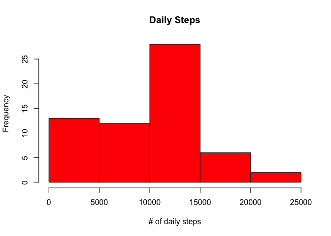
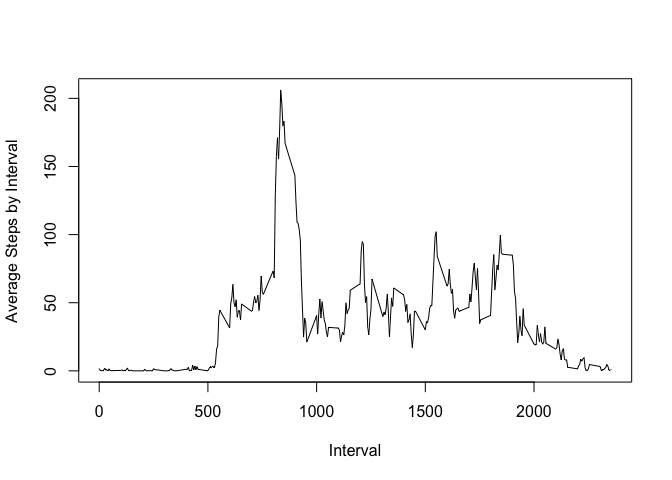
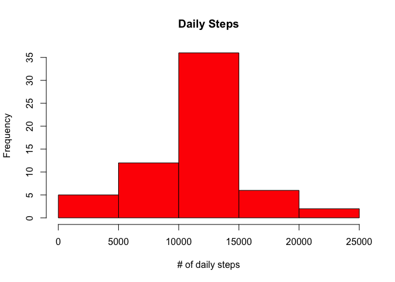
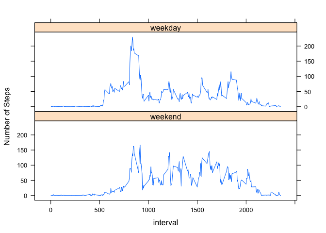

# Reproducible Research: Peer Assessment 1


## Loading and preprocessing the data

```r
library(plyr)
library(lattice)
myURL <- "https://d396qusza40orc.cloudfront.net/repdata%2Fdata%2Factivity.zip"
download.file(url = myURL, "myFile.zip", method = "curl")
unzip("myFile.zip")
activity <- read.csv("activity.csv")
```

## What is mean total number of steps taken per day?
### Here is a histogram of the total number of steps taken each day

```r
daily_step <- ddply(activity, .(date), summarize, total_daily_steps = sum(steps, na.rm = T))
hist(daily_step$total_daily_steps, main ="Daily Steps", xlab = "# of daily steps", col = 'Red')
```

<!-- -->

```r
mean_step <- mean(daily_step$total_daily_steps)
median_step <- median(daily_step$total_daily_steps)
```
The mean total number of steps taken per day is 9354.2295082 and the median is 10395.

## What is the average daily activity pattern?
### Here is a time series plot of the average number of steps taken

```r
interval_avg_step <- ddply(activity, .(interval), summarize, avg_steps = mean(steps, na.rm = T))

with(interval_avg_step,plot(interval, avg_steps, type="l", xlab="Interval",
                   ylab="Average Steps by Interval"))
```

<!-- -->

```r
max_interval <- interval_avg_step[which.max(interval_avg_step$avg_steps), ]$interval
```

835 is the 5-minute interval that, on average, contains the maximum number of steps

## Imputing missing values
### Missing values in the dataset were replaced by the average number of steps for the same interval. To do this, I first joined the original dataset with average step per interval previously generated. Then, I replaced the missing value with the interval average

### Here is a new histogram of the total number of steps taken each day after missing values are imputed

```r
n_missing <- sum(is.na(activity))

dt <- merge(activity, interval_avg_step)

for (i in 1:nrow(dt)) {
    if (is.na(dt[i, ]$steps)) {
        dt[i, ]$steps <- dt[i, ]$avg_steps
    }
}

activity_complete <- dt[, 1:3][order(dt$date, dt$interval), ]

daily_step2 <- ddply(activity_complete, .(date), summarize, total_daily_steps = sum(steps, na.rm = T))
hist(daily_step2$total_daily_steps, main ="Daily Steps", xlab = "# of daily steps", col = 'Red')
```

<!-- -->

```r
new_mean <- mean(daily_step2$total_daily_steps)
new_median <- median(daily_step2$total_daily_steps)
```
There are a total of 2304 rows with missing values in the dataset. After filling in missing values, the mean total number of steps taken per day is 1.0766189\times 10^{4} and the median is 1.0766189\times 10^{4}.


## Are there differences in activity patterns between weekdays and weekends?
### Here is the panel plot comparing the average number of steps taken per 5-minute interval across weekdays and weekends

```r
activity_complete$date <- as.Date(activity_complete$date)
weekdays1 <- c('Monday', 'Tuesday', 'Wednesday', 'Thursday', 'Friday')
activity_complete$wDay <- factor((weekdays(activity_complete$date) %in% weekdays1), 
                   levels=c(FALSE, TRUE), labels=c('weekend', 'weekday')) 

interval_avg_step2 <- ddply(activity_complete, .(interval, wDay), summarize, avg_steps = mean(steps, na.rm = T))

xyplot(avg_steps ~ interval | wDay, data = interval_avg_step2,layout = c(1, 2), type="l"
       , ylab = "Number of Steps")
```

<!-- -->

